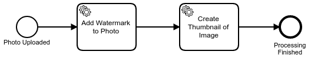

# zb-facebam

This project implements example application which consist of 3 services: board,
thumbnail and watermarking.

The process which is implemented is the following:




**Note:** The services work on a hard coded path `/tmp/watermarking` which
will probably only work in \*UNIX like environments.

## Requirements

* Java 1.8
* Golang 1.5+
* [Running Zeebe broker](https://docs.zeebe.io/introduction/install.html)
* [zbctl](https://github.com/zeebe-io/zbc-go/releases)


## Setup

First create topic which will be used by our process.

```
zbctl create topic --name default-topic --partitions 1
```

then create workflow on the broker.

```
zbctl create workflow process.bpmn
```


To start microservices use `make` command. Open 3 terminals and in each of
them start 1 service with the following commands:

```
make board
```

After starting this service, point your browser to http://localhost:5000 and
click on the upload photo button. Select some PNG photo and confirm the upload.

```
make watermark
```

This service will watermark uploaded image. You should see some output similar
to the following.


```
Saved watermarked image to /tmp/watermarking/...
```

Then start the thumbnail service.

```
make thumbnail
```

This service will create thumbnail of the uploaded image. You should see some
output similar to the following.

```
Waiting for events ....
Saved thumbnail to /tmp/watermarking/...
Task completed successfully.
```

After you uploaded an image and the task services processes it you can visit
http://localhost:5000/images/ and refresh the page using CTRL+F5 to list the
process images.

## Code of Conduct

This project adheres to the Contributor Covenant [Code of
Conduct](/CODE_OF_CONDUCT.md). By participating, you are expected to uphold
this code. Please report unacceptable behavior to code-of-conduct@zeebe.io.

## License

zb-facebam is distributed under the terms of the Apache License (Version 2.0).

See [LICENSE](/LICENSE) for details.
